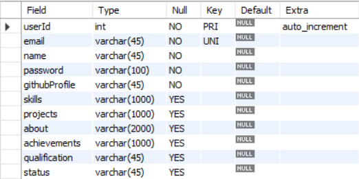

# Besume

Besume - "Build a resume"

It is a website for building resume that looks great and does not require much effort to build.

[Sample Resume created from this repo](Besume.pdf)

## Run Locally

Clone the project

```bash
  git clone https://github.com/Sammmy22/besume
```

Go to the project directory

```bash
  cd besume
```

Install dependencies

```bash
  cd backend
  npm install
```

Create a `.env` file in the backend directory and add the following variables to it with the values you want to use

```
  DB_HOST=
  DB_USER=
  DB_PASSWORD=
  DB_DATABASE=
  DB_PORT=
  PORT=
```

Start the server

```bash
  nodemon dbServer
```

# The Database

Create a database named `userdb` and create a table inside it named `usertable`

## Table schema



## Tech Stack

**Client:** HTML, Bootstrap

**Server:** Node, Express, MySQL
